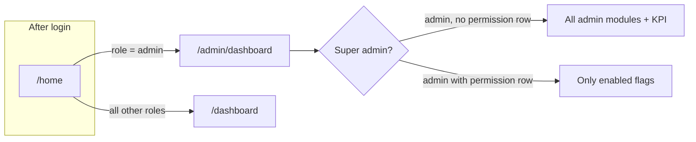
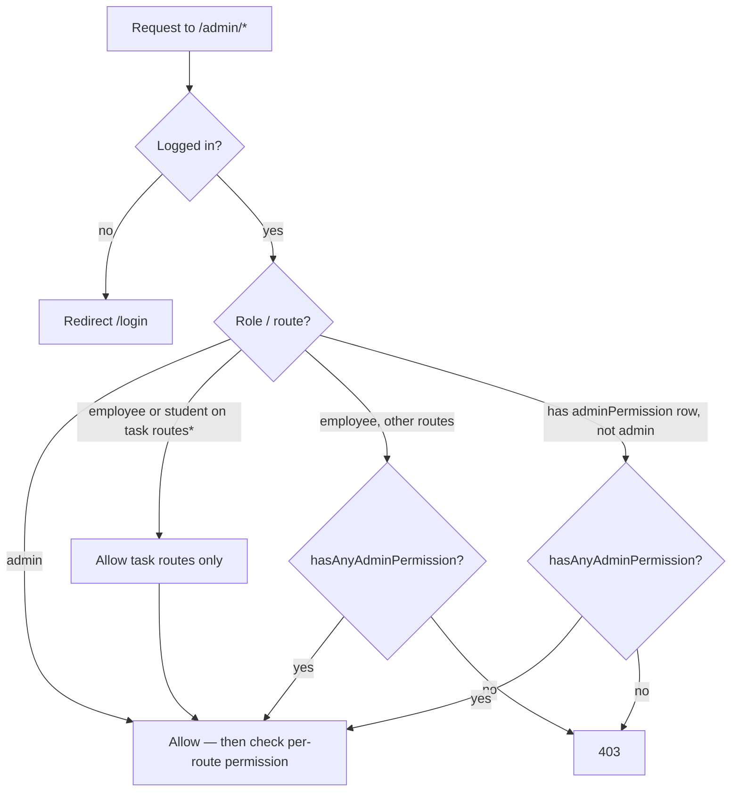
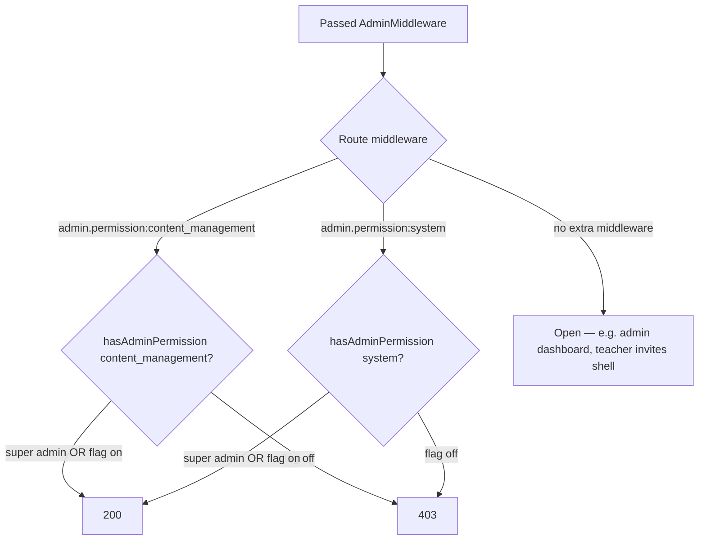
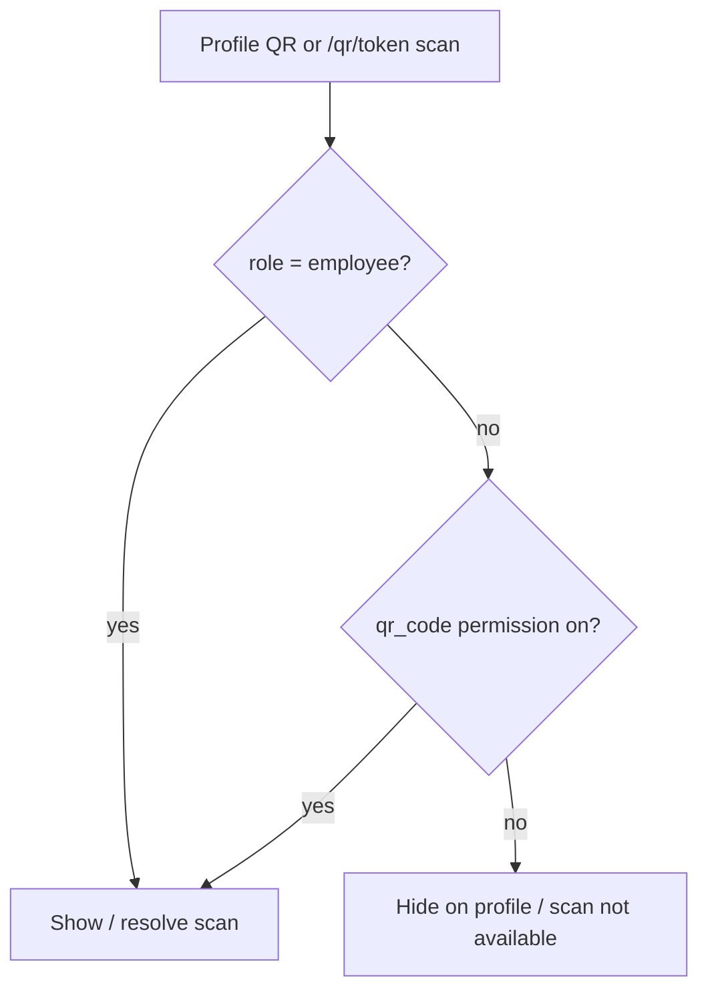
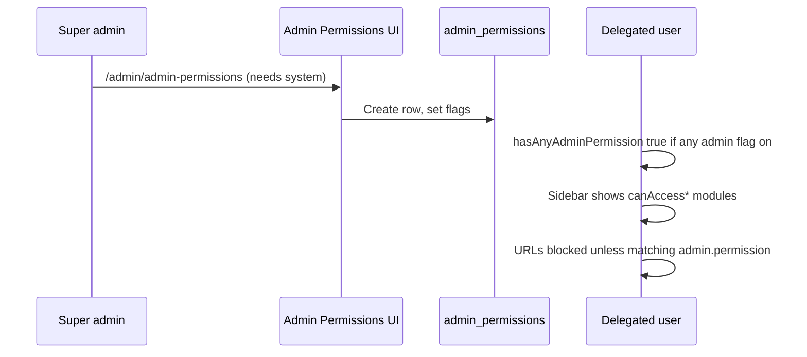

# Admin access map

How **roles**, **`admin` middleware**, and **`admin_permissions`** flags combine to control what users can open.

---

## Quick reference: permission flags

| Flag | Admin routes / features | Sidebar helper |
|------|-------------------------|----------------|
| `content_management` | Quizzes, forum, news, evaluations, manual grading, import, universities, **tasks** (full module) | `canAccessContentManagement()` |
| `analytics_reports` | Parent for Analytics & Reports (use sub-features below) | `canAccessAnalyticsReports()` |
| *(sub)* `analytics` | Student Performance Analytics (`/admin/analytics`) | `canAccessAnalyticsFeature('analytics')` |
| *(sub)* `error_logs` | Error Logs | `canAccessAnalyticsFeature('error_logs')` |
| *(sub)* `user_activity` | User Activity (also allowed via `system`) | `canAccessAnalyticsFeature('user_activity')` |
| *(sub)* `students_review` | Students Review | `canAccessAnalyticsFeature('students_review')` |
| `employee_management` | Employee dashboard, admin DTR, time report, admin leave (employees); optional **employee department** scope | `canAccessEmployeeManagement()` |
| `student_management` | Student dashboard, student DTR/leave, time requests; optional **student department** scope | `canAccessStudentManagement()` |
| `hiring_process` | Hiring process, positions, applications; optional **allowed positions** | `canAccessHiringProcess()` |
| `communication` | Notifications, contact messages, tickets, live chat | `canAccessCommunication()` |
| `linked_accounts` | Linked accounts, Starlinks, Omada, plan types | `canAccessLinkedAccounts()` |
| `billing` | Billing, statements, mark paid | `canAccessBilling()` |
| `files` | Admin file storage | `canAccessFiles()` |
| `confession` | Say-it / confession moderation | `canAccessConfession()` |
| `feedback` | Admin feedback management | `canAccessFeedback()` |
| `user_management` | Users, departments, teacher MOA, teacher invite links | `canAccessUserManagement()` |
| `system` | Settings, rules, API monitoring, **admin permissions CRUD**, landing page, stacks, user activity | `canAccessSystem()` |
| `qr_code` | **No admin routes** — profile QR display + public `/qr/{token}` scan | `canAccessQrCode()` |

Middleware on routes: `admin.permission:{flag}` → `User::hasAdminPermission('{flag}')`.

---

## Role → where they land

| Role | Default home | Admin panel (`/admin/*`) |
|------|--------------|---------------------------|
| `admin` (no permission row) | `/admin/dashboard` | **Super admin** — all flags treated as on |
| `admin` (with permission row) | `/admin/dashboard` | Only enabled flags |
| `employee` | `/dashboard` | Tasks always*; other `/admin` only if `hasAnyAdminPermission()` |
| `student` | `/dashboard` | Tasks always*; other `/admin` only if has row + `hasAnyAdminPermission()` |
| `teacher` | `/dashboard` | No `/admin` (user routes: `/teacher/*`) |
| `technician` | `/dashboard` | No `/admin` (user routes: `/technician/tickets`) |
| `applicant` | `/dashboard` | No `/admin` unless given permission row + flags |
| `user` | `/dashboard` | Same as student/applicant if delegated |

\*See **Task exception** below.

---

## Gate 1: Can they enter `/admin` at all?

`AdminMiddleware` (`auth` + `admin` on `/admin` prefix).

**Task exception** (no `hasAnyAdminPermission` required): `admin.tasks.index`, `admin.tasks.store|update|destroy`, reorder, comments, attachments, assign-users, invitations, join-by-code/link, custom boards, task lists, custom priorities.

---

## Gate 2: Can they open a specific admin URL?

**Super admin rule:** `admin` role **without** an `admin_permissions` row → every `hasAdminPermission('*')` returns **true**.

**Restricted rule:** Any user **with** an `admin_permissions` row → each flag is read from the database (role does not auto-grant flags).

---

## Gate 3: Identification QR (separate from admin panel)

`qr_code` is **not** included in `hasAnyAdminPermission()`, so **QR-only** delegates do **not** get general `/admin` access (except students/employees on task URLs).

---

## Role × area matrix (defaults without delegation)

| Area | admin (super) | admin (restricted) | employee | student | teacher | technician | applicant |
|------|:-------------:|:------------------:|:--------:|:-------:|:-------:|:----------:|:---------:|
| User portal `/dashboard`, profile, chat | — | — | ✓ | ✓* | ✓ | ✓ | ✓ |
| User quizzes | — | — | ✓ | ✓* | ✗ | ✗ | intern only |
| `/admin` full panel | ✓ | flags only | flags + tasks | flags + tasks | ✗ | ✗ | flags if assigned |
| Admin dashboard `/admin/dashboard` | ✓ | if any flag† | if any flag† | if any flag† | ✗ | ✗ | if any flag† |
| KPI `/admin/kpi/dashboard` | ✓ | ✗ | ✗ | ✗ | ✗ | ✗ | ✗ |
| Admin tasks (My/Group) | ✓ | needs `content_management` for full module; task URLs bypass middleware list | ✓ routes | ✓ routes | ✗ | ✗ | ✗ |
| ID QR scan | ✓ | `qr_code` if not employee | ✓ always | `qr_code` | `qr_code` | `qr_code` | `qr_code` |

\*Terminated students are blocked by `student.not_terminated`.  
†Controller also requires `isSuperAdmin() || hasAnyAdminPermission()` for the dashboard view.

---

## Delegation flow (how admins assign access)

**Who can be added in Admin Permissions**

- Super admin: any user without a row yet.
- Non–super admin: employees only (controller rule).

---

## Scoped permissions (sub-limits)

When a flag is on, optional JSON scopes further limit data:

| Parent flag | Scope field | Effect |
|-------------|-------------|--------|
| `employee_management` | `allowed_employee_departments` | Empty = all departments; else only listed IDs |
| `student_management` | `allowed_student_departments` | Same for students |
| `hiring_process` | `allowed_positions` | Empty = all positions; else only listed hiring position IDs |

Helpers: `canManageDepartment()`, `getAllowedDepartmentIds()`, hiring `canAccessPosition()` in controllers.

---

## User portal (not admin flags)

These use `auth` (+ `student.not_terminated` for most). **Not** controlled by `admin_permissions`:

- Dashboard, profile, friends, user chat, support chat/tickets (user side)
- Quizzes (role rules in `canViewAssignedQuizzes()`)
- User files, forum, evaluations, notifications, DTR/leave (user controllers)
- Teacher: `/teacher/*` | Technician: `/technician/tickets`

---

## Code anchors

| Piece | Location |
|-------|----------|
| Admin entry | `app/Http/Middleware/AdminMiddleware.php` |
| Per-feature gate | `app/Http/Middleware/CheckAdminPermission.php` |
| Flag checks | `app/Models/User.php` — `hasAdminPermission`, `canAccess*`, `hasAnyAdminPermission` |
| Routes | `routes/web.php` — `Route::prefix('admin')` groups |
| Permission UI | `app/Http/Controllers/Admin/AdminPermissionController.php` |
| QR | `app/Models/User.php` — `canAccessQrCode()`; `app/Http/Controllers/QrCodeController.php` |

---

## Known gap

- Sidebar links to `/admin/my-permissions` but **no route** is registered in `routes/web.php` (controller `myPermissions()` exists). Register a route if that page should load.
